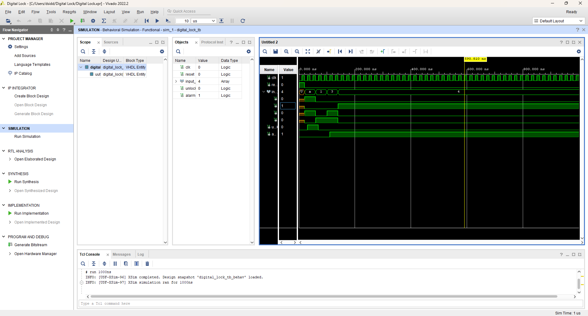
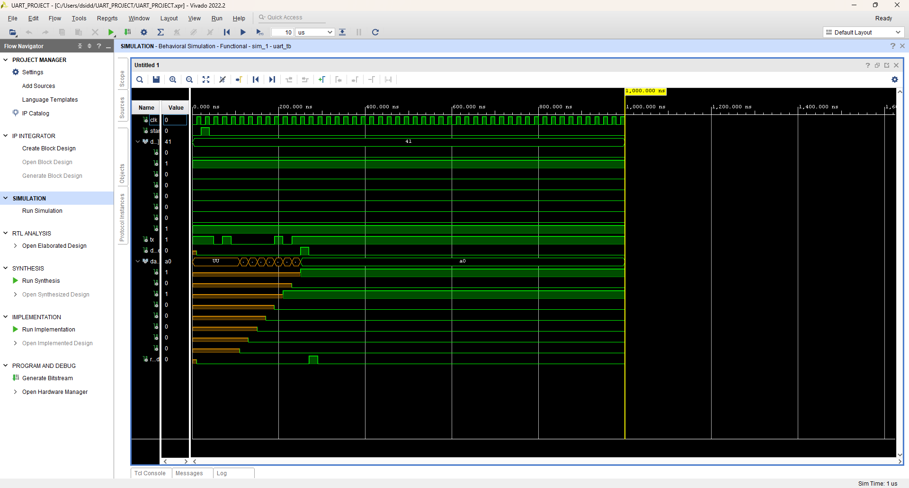

# 🔐 VHDL Digital Systems Projects
### Smart Digital Lock & UART Protocol Design using VHDL

This repository contains two VLSI/Digital Design projects developed using **VHDL** and simulated using **Vivado Design Suite**.

These projects were created as part of an **Industrial Internship Project** focusing on **Digital Logic Design and Hardware Simulation**.

---

# 📁 Projects Included

1. Smart Digital Lock System (VHDL)  
2. UART Protocol Design (Transmitter & Receiver)

---

# 🛠 Tools & Technologies

- VHDL (Hardware Description Language)
- Vivado Design Suite
- Behavioral Simulation
- Digital Logic Design
- Finite State Machine (FSM)
- Serial Communication Protocol (UART)

---

# 🔐 Project 1: Smart Digital Lock System

## 📌 Objective

Design a **password-based digital lock system** using VHDL that validates a user password and controls unlocking with security protection.

---

## ⚙️ System Features

- Predefined **4-bit password**
- Password verification logic
- Unlock signal generation
- Incorrect attempt counter
- Alarm activation after **three wrong attempts**

---

## 🧠 System Working

1. System initializes in **reset state**
2. User enters a **4-bit password input**
3. If the password matches the stored password:
   - **Unlock signal becomes HIGH**
4. If the password is incorrect:
   - Attempt counter increments
5. After **3 incorrect attempts**
   - **Alarm signal is triggered**

---

## 📊 Simulation Result

The waveform demonstrates:

- Clock signal operation
- Password input sequence
- Unlock activation when password is correct
- Alarm activation after multiple incorrect attempts

---

# 📡 Project 2: UART Protocol Design

## 📌 Objective

Implement **UART (Universal Asynchronous Receiver Transmitter)** communication using VHDL.

UART is one of the most widely used **serial communication protocols** for transmitting data between digital systems.

---

## ⚙️ UART Modules

The system includes three main components:

- UART Transmitter (TX)
- UART Receiver (RX)
- Testbench for simulation

---

## 📡 UART Frame Format

UART communication sends data in the following format:

Start Bit | 8 Data Bits | Stop Bit

Example transmission:

Start → 01000001 → Stop

ASCII Value:

01000001 = 'A'

---

## 🧠 Working Principle

1. Parallel data is provided to the **UART transmitter**
2. The transmitter converts it into **serial data**
3. Data is sent bit-by-bit through the TX line
4. The receiver detects the start bit and begins receiving data
5. Received bits are reconstructed into the original parallel data

---

## 📊 Simulation Result

The simulation waveform shows:

- Clock generation
- Start bit transmission
- Serial bit shifting
- Receiver reconstructing original data
- Output data verification

Example transmitted value:

Input Data = 0x41 (ASCII 'A')
Received Data = 0x41

---

# 📂 Repository Structure

VLSI-Internship-Projects
│
├── Digital_Lock
│ ├── digital_lock.vhd
│ ├── digital_lock_tb.vhd
│
├── UART_Project
│ ├── uart_tx.vhd
│ ├── uart_rx.vhd
│ ├── uart_tb.vhd
│
├── images
│ ├── digital_lock_simulation.png
│ └── uart_simulation.png
│
└── README.md

---

# ▶️ How to Run the Projects

1. Open **Vivado Design Suite**
2. Create a new **VHDL RTL Project**
3. Add the VHDL source files
4. Add the **testbench files**
5. Run **Behavioral Simulation**
6. Observe waveform outputs

---

# 👨‍💻 Author

**Siddhant Deshmukh**

Industrial Internship Project  
Digital Systems & VLSI Design
